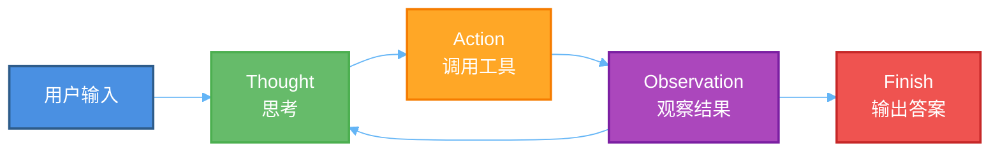
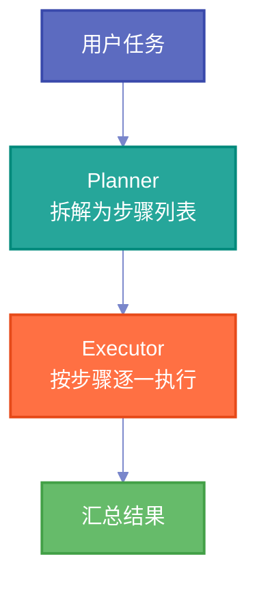
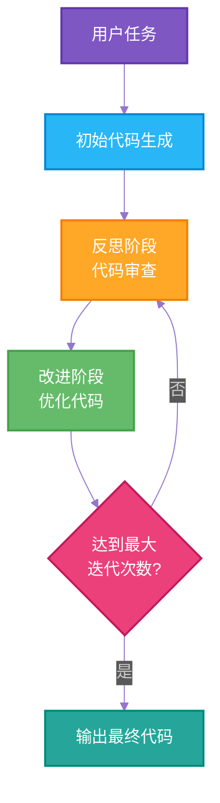
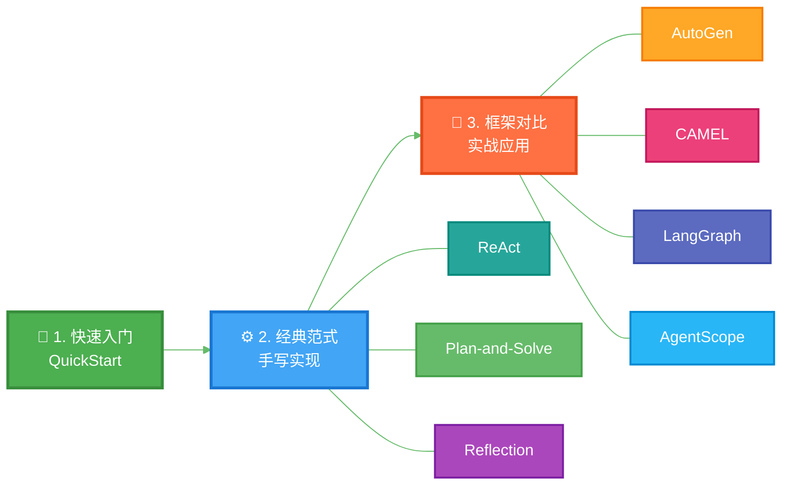

# AI Agent 学习与实践

> 从零开始学习 AI Agent —— 涵盖经典范式手写实现 + 主流框架对比实战

## 项目简介

本项目是一个 AI Agent 的学习与实践仓库，包含以下核心内容：

- **快速入门**：用最简代码跑通一个 ReAct Agent
- **经典范式手写实现**：不依赖框架，手写 ReAct / Plan-and-Solve / Reflection 三大经典 Agent 范式
- **主流框架对比实战**：用 AutoGen、CAMEL、LangGraph、AgentScope 四大框架构建实际应用

## 项目结构

```
ai-agent/
├── quick_start/                             # 快速入门
│   └── quick_start.py                       #   ReAct 旅行助手 Demo
│
├── construction_of_classic_agent_paradigms/ # 经典 Agent 范式手写实现
│   ├── llm_client.py                        #   LLM 客户端基础封装
│   ├── plan_and_solve_agent.py              #   Plan-and-Solve 范式
│   ├── react/                               #   ReAct 范式
│   │   ├── react_agent.py                   #     ReAct Agent 骨架
│   │   ├── search_tool.py                   #     搜索工具（SerpApi）
│   │   └── tool_executor.py                 #     工具注册与执行器
│   └── reflection/                          #   Reflection 反思范式
│       ├── memory.py                        #     轨迹记忆模块
│       └── reflection.py                    #     反思 Agent（代码迭代优化）
│
├── framework_study/                         # 主流框架对比实战
│   ├── autogen/                             #   AutoGen —— 多 Agent 软件开发团队
│   ├── camel/                               #   CAMEL  —— 角色扮演协作
│   ├── langgraph/                           #   LangGraph —— 状态图 ReAct Agent
│   └── agent_scope_demo/                    #   AgentScope —— 三国狼人杀游戏
│
├── doc/                                     # 学习文档
│   └── 二、agent 快速入门.md
│
├── run_reflection.py                        # Reflection Agent 运行入口
└── README.md
```

## 模块详解

### 一、快速入门（quick_start）

一个最简 ReAct 旅行助手，输入城市名称，自动查天气 → 推荐景点。

- 封装了 OpenAI 兼容客户端
- 集成天气查询（wttr.in）和景点搜索（Tavily）
- 用正则解析 Thought → Action → Observation 循环


```mermaid
%%{init: {'theme':'dark', 'themeVariables': { 'primaryColor':'#4A90E2','primaryTextColor':'#fff','primaryBorderColor':'#2E5C8A','lineColor':'#64B5F6','secondaryColor':'#66BB6A','tertiaryColor':'#FFA726'}}}%%
flowchart LR
    A["用户输入"] --> B["Thought<br/>思考"]
    B --> C["Action<br/>调用工具"]
    C --> D["Observation<br/>观察结果"]
    D --> B
    D --> E["Finish<br/>输出答案"]
    
    style A fill:#4A90E2,stroke:#2E5C8A,stroke-width:2px,color:#fff
    style B fill:#66BB6A,stroke:#4CAF50,stroke-width:2px,color:#fff
    style C fill:#FFA726,stroke:#F57C00,stroke-width:2px,color:#fff
    style D fill:#AB47BC,stroke:#7B1FA2,stroke-width:2px,color:#fff
    style E fill:#EF5350,stroke:#C62828,stroke-width:2px,color:#fff
```

### 二、经典 Agent 范式手写实现（construction_of_classic_agent_paradigms）

不借助任何框架，纯手写三大经典范式：

| 范式 | 核心思想 | 对应文件 |
|------|---------|---------|
| **ReAct** | 思考 → 行动 → 观察，循环推理 | `react/` |
| **Plan-and-Solve** | 先制定计划，再逐步执行 | `plan_and_solve_agent.py` |
| **Reflection** | 生成 → 反思 → 改进，迭代优化 | `reflection/` |

#### Plan-and-Solve 流程


```mermaid
%%{init: {'theme':'dark', 'themeVariables': { 'primaryColor':'#5C6BC0','primaryTextColor':'#fff','primaryBorderColor':'#3949AB','lineColor':'#7986CB','secondaryColor':'#26A69A','tertiaryColor':'#FF7043'}}}%%
flowchart TD
    A["用户任务"] --> B["Planner<br/>拆解为步骤列表"]
    B --> C["Executor<br/>按步骤逐一执行"]
    C --> D["汇总结果"]
    
    style A fill:#5C6BC0,stroke:#3949AB,stroke-width:2px,color:#fff
    style B fill:#26A69A,stroke:#00897B,stroke-width:2px,color:#fff
    style C fill:#FF7043,stroke:#E64A19,stroke-width:2px,color:#fff
    style D fill:#66BB6A,stroke:#43A047,stroke-width:2px,color:#fff
```

#### Reflection 流程


```mermaid
%%{init: {'theme':'dark', 'themeVariables': { 'primaryColor':'#7E57C2','primaryTextColor':'#fff','primaryBorderColor':'#5E35B1','lineColor':'#9575CD','secondaryColor':'#29B6F6','tertiaryColor':'#FFA726'}}}%%
flowchart TD
    A["用户任务"] --> B["初始代码生成"]
    B --> C["反思阶段<br/>代码审查"]
    C --> D["改进阶段<br/>优化代码"]
    D --> E{"达到最大<br/>迭代次数?"}
    E -- 否 --> C
    E -- 是 --> F["输出最终代码"]
    
    style A fill:#7E57C2,stroke:#5E35B1,stroke-width:2px,color:#fff
    style B fill:#29B6F6,stroke:#0288D1,stroke-width:2px,color:#fff
    style C fill:#FFA726,stroke:#F57C00,stroke-width:2px,color:#fff
    style D fill:#66BB6A,stroke:#43A047,stroke-width:2px,color:#fff
    style E fill:#EC407A,stroke:#C2185B,stroke-width:2px,color:#fff
    style F fill:#26A69A,stroke:#00897B,stroke-width:2px,color:#fff
```

### 三、主流框架对比实战（framework_study）

| 框架 | 场景 | 亮点 |
|------|------|------|
| **AutoGen** | 多 Agent 软件开发团队 | 产品经理 + 工程师 + 代码审查员协作，Round-Robin 群聊 |
| **CAMEL** | 心理学电子书写作 | 心理学家 + 作家角色扮演，任务自动细化 |
| **LangGraph** | 天气 & 搜索助手 | 状态图工作流，条件分支路由，流式输出 |
| **AgentScope** | 三国狼人杀游戏 | 多角色博弈，昼夜轮替，投票与讨论机制 |


```mermaid
%%{init: {'theme':'dark', 'themeVariables': { 'primaryColor':'#42A5F5','primaryTextColor':'#fff','primaryBorderColor':'#1976D2','lineColor':'#64B5F6'}}}%%
flowchart TB
    subgraph AutoGen["🤖 AutoGen - 多 Agent 协作"]
        PM["产品经理"] <--> ENG["工程师"]
        ENG <--> CR["代码审查员"]
        CR <--> UP["用户代理"]
    end
    
    subgraph CAMEL["🎭 CAMEL - 角色扮演"]
        R1["心理学家"] <--> R2["作家"]
    end
    
    subgraph LangGraph["🔄 LangGraph - 状态图"]
        AG["Agent 节点"] -->|调用工具| TN["Tool 节点"]
        TN -->|返回结果| AG
    end
    
    subgraph AgentScope["🎮 AgentScope - 游戏"]
        WW["狼人"] ~~~ SE["预言家"]
        SE ~~~ WI["女巫"]
        WI ~~~ VI["村民"]
    end
    
    style PM fill:#42A5F5,stroke:#1976D2,stroke-width:2px,color:#fff
    style ENG fill:#66BB6A,stroke:#43A047,stroke-width:2px,color:#fff
    style CR fill:#FFA726,stroke:#F57C00,stroke-width:2px,color:#fff
    style UP fill:#AB47BC,stroke:#7B1FA2,stroke-width:2px,color:#fff
    
    style R1 fill:#EC407A,stroke:#C2185B,stroke-width:2px,color:#fff
    style R2 fill:#26A69A,stroke:#00897B,stroke-width:2px,color:#fff
    
    style AG fill:#5C6BC0,stroke:#3949AB,stroke-width:2px,color:#fff
    style TN fill:#FF7043,stroke:#E64A19,stroke-width:2px,color:#fff
    
    style WW fill:#EF5350,stroke:#C62828,stroke-width:2px,color:#fff
    style SE fill:#29B6F6,stroke:#0288D1,stroke-width:2px,color:#fff
    style WI fill:#AB47BC,stroke:#7B1FA2,stroke-width:2px,color:#fff
    style VI fill:#66BB6A,stroke:#43A047,stroke-width:2px,color:#fff
```

## 快速开始

### 环境要求

- Python 3.10+
- OpenAI 兼容 API（如 DeepSeek、OpenAI 等）

### 安装依赖

各模块有独立的依赖，按需安装：

```bash
# AutoGen
pip install -r framework_study/autogen/requirements.txt

# CAMEL
pip install -r framework_study/camel/requirements.txt

# LangGraph
pip install -r framework_study/langgraph/requirements.txt

# AgentScope
pip install -r framework_study/agent_scope_demo/requirements.txt
```

### 配置 API Key

```bash
# 设置环境变量（以 DeepSeek 为例）
export OPENAI_API_KEY="your-api-key"
export OPENAI_API_BASE_URL="https://api.deepseek.com"
```

或参考 `framework_study/autogen/.env.example` 创建 `.env` 文件。

### 运行示例

```bash
# 快速入门 - ReAct 旅行助手
python quick_start/quick_start.py

# Reflection Agent - 代码迭代优化
python run_reflection.py

# AutoGen - 多 Agent 协作
python framework_study/autogen/main.py

# CAMEL - 角色扮演
python framework_study/camel/camel_demo.py

# LangGraph - 状态图 Agent
python framework_study/langgraph/langgraph_demo.py

# AgentScope - 三国狼人杀
python framework_study/agent_scope_demo/main.py
```

## 学习路线


```mermaid
%%{init: {'theme':'dark', 'themeVariables': { 'primaryColor':'#4CAF50','primaryTextColor':'#fff','primaryBorderColor':'#388E3C','lineColor':'#66BB6A'}}}%%
flowchart LR
    A["🚀 1. 快速入门<br/>QuickStart"] --> B["⚙️ 2. 经典范式<br/>手写实现"]
    B --> C["🎯 3. 框架对比<br/>实战应用"]
    
    B --- B1["ReAct"]
    B --- B2["Plan-and-Solve"]
    B --- B3["Reflection"]
    
    C --- C1["AutoGen"]
    C --- C2["CAMEL"]
    C --- C3["LangGraph"]
    C --- C4["AgentScope"]
    
    style A fill:#4CAF50,stroke:#388E3C,stroke-width:3px,color:#fff
    style B fill:#42A5F5,stroke:#1976D2,stroke-width:3px,color:#fff
    style C fill:#FF7043,stroke:#E64A19,stroke-width:3px,color:#fff
    
    style B1 fill:#26A69A,stroke:#00897B,stroke-width:2px,color:#fff
    style B2 fill:#66BB6A,stroke:#43A047,stroke-width:2px,color:#fff
    style B3 fill:#AB47BC,stroke:#7B1FA2,stroke-width:2px,color:#fff
    
    style C1 fill:#FFA726,stroke:#F57C00,stroke-width:2px,color:#fff
    style C2 fill:#EC407A,stroke:#C2185B,stroke-width:2px,color:#fff
    style C3 fill:#5C6BC0,stroke:#3949AB,stroke-width:2px,color:#fff
    style C4 fill:#29B6F6,stroke:#0288D1,stroke-width:2px,color:#fff
```

建议按 **快速入门 → 经典范式 → 框架实战** 的顺序学习，先理解底层原理，再用框架提效。

## @author

DD
